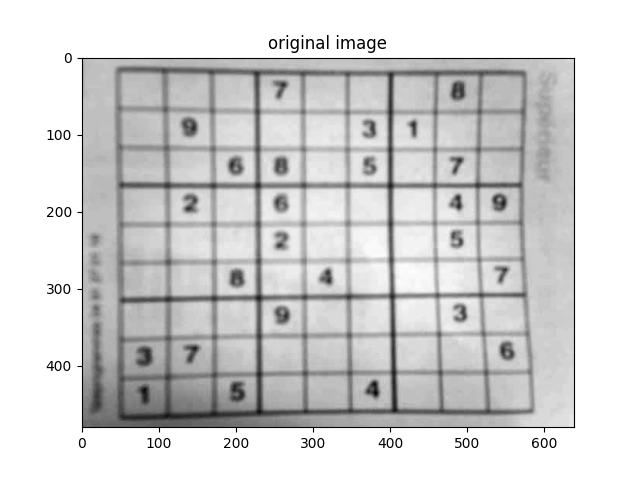
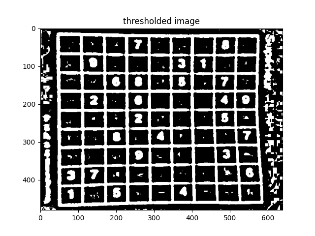
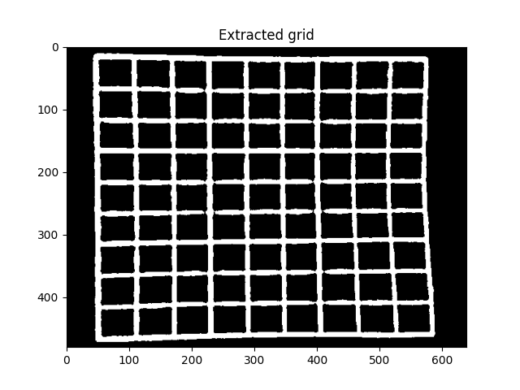
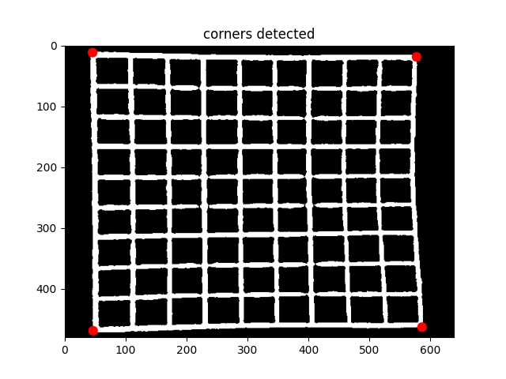

# SideSolver
I am making a sudoku scanner and solver to learn more about OpenCV, Tensorflow and Python. Because coding is fun.  
The idea is that a user scans a photo of a puzzle into the app, and the app spits out the solution.

### Some progress:

21 March 2020 - *Original*:  
Started with the project. This is the original in grayscale

  

22 March 2020 - *Thresholding*:  
Played around with different thresholding methods and found adaptive gaussian to indeed work the best. (Makes everything either black or white

  

30 March 2020 - *Floodfilling and blob detection*  
I found OpenCV's blob function to not quite work the way I wanted (and I could not get it to work immediately #noob) so I wrote my own (it's really slow and cringy and but it works ;))

  

25 April 2020 - *Corner detection*
After about a month of battling with this (and trying numerous different approaches), I got it to work (whoop whoop). After finding the grid, OpenCV's contour detection was applied. This returns the coordinates of the pixels in the contours.   
The corners can be found by iterating through the coordinates and applying some logic.    

- The sum of the bottom left corner should have a small x and y coordinates.  
- Top left: Small x but large y.  
- Top right: Large x and large y.  
- Bottom right: Large x and small y.  

These are the coordinates of the corners!

    

(I tried the line detection approach - where you apply hough transformation and calculate intersection of the lines as the corners, but it seemed in some cases not all the lines of the grid were found)

### To do:
- Add pipeline to check style and unit tests. 
- Code coverage could be cool thing to add 
- ~~find grid~~
- ~~Determine locations of corners of grid~~
- Apply homography, plot grid to new image (this way we can throw away everything outside of the grid, making it easier to determine position of digits).
- Determine locations of digits
- Identify digits
- Map final product to array and solve

- Create interface

- Experiment with Deep Belief Network

- Optimize and Neaten 

## Dudes I basically plagiarized/ got inspiration from:
- http://sudokugrab.blogspot.com/2009/07/how-does-it-all-work.html

- https://aishack.in/tutorials/sudoku-grabber-opencv-detection

### Constructive critism welcome. #BeLekker