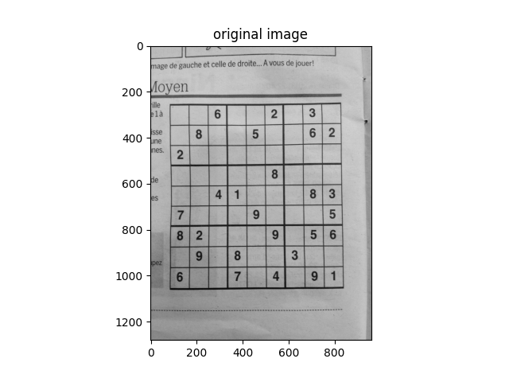
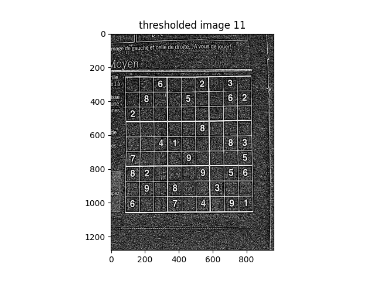
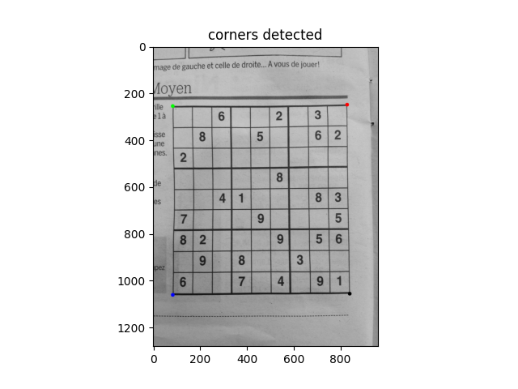
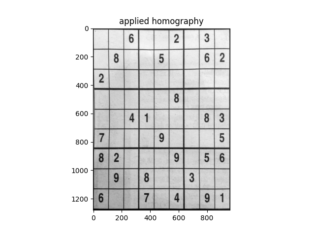
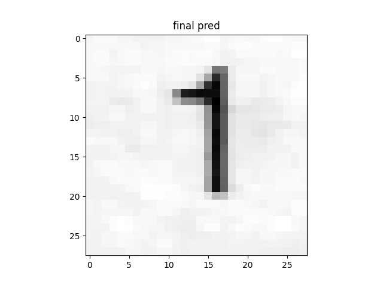

# SideSolver
I am making a sudoku scanner and solver to learn more about OpenCV, Tensorflow and Python.  
The idea is that a user scans a photo of a puzzle into the app, and the app spits out the solution.

A CNN digit classifier is trained on sudoku digits from sudoku puzzles. (Initially classifier was trained with MNIST but this yielded poor results.)

A puzzle is loaded, the puzzle grid is extracted. The digits are isolated and sent to the classifier.

### Some progress:

21 March 2020 - *Original*:  
Started with the project. This is the original in grayscale

 

22 March 2020 - *Thresholding*:  
Played around with different thresholding methods and found adaptive gaussian to indeed work the best. (Makes everything either black or white

 | 

30 March 2020 - *Floodfilling and blob detection*  
I found OpenCV's blob function to not quite work the way I wanted (and I could not get it to work immediately #noob) so I wrote my own (it's really slow and cringy and but it works ;))

  

25 April 2020 - *Corner detection*  
After about a month of battling with this (and trying numerous different approaches), I got it to work (whoop whoop). After finding the grid, OpenCV's contour detection was applied. This returns the coordinates of the pixels in the contours.   
The corners can be found by iterating through the coordinates and applying some logic.    

- The sum of the bottom left corner should have a small x and y coordinates.  
- Top left: Small x but large y.  
- Top right: Large x and large y.  
- Bottom right: Large x and small y.  

These are the coordinates of the corners!

 

(I tried the line detection approach - where you apply hough transformation and calculate intersection of the lines as the corners, but it seemed in some cases not all the lines of the grid were found)  

3rd May 2020 - *Homography*  
This was much easier than corner detection. The idea behid homography is to map one plane to another. In our case we want to map the grid to an entire new image. We provide OpenCV with 4 corners from the original and 4 corners of the destination image (which is a just the corners of a blank image) and it finds the mapping. [This guy](https://www.learnopencv.com/image-alignment-feature-based-using-opencv-c-python) explains rather well how to solve the equation to find *H*, the homography from one plane to another.  

   

(Look at that. It's beautiful)  

3rd May 2020 - *Fetching and recognizing the digits*  

So getting the locations of the digits is pretty straight forward. We just divide the new image into 9 by 9 blocks.  
The tricky part (with this specific dataset) is the preprocessing for recognition.  
Traditionally we would center, erode and dilate to make sure we remove noise and only include the digit (not the border) in the recognition. But the digits are a bit blurry,(see the thresholded image) and the most of the digits with circles in them (8,6,9) get turned into zeros. Applying erosion alone also doesn't solve the problem.  
(For now I'll experiment with different kernels and gaussian thresholds. Any suggestions?? )  

Also, instead of changing my solution, I changed the [problem](https://wimdecoach.nl/korte-ondersteuning/the-problem-is-not-the-problem).  
I tried a different, clearer, more modern day photo of a puzzle and it seems to work well. I'll add phots comparing the 2 datasets before and after processing.

June - *MNIST problems*:

So I cropped borders (to remove grid lines vissible in the digit) and send the digits to be classified by a MNIST trained CNN classifier.  

MNIST digit]             |  Suduku digit (before centering, floodfilling)
:-------------------------:|:-------------------------:
  |  

The results were terrible.  
We got a 70 % accuracy for the entire puzzle. 56 of the 70 % was the correct clasification of blank cells. This means our **digit classification accuracy was less than 20 %**. (All digits were either classified as 1, 7, 3 or 0) 

Issues with this approach:   

- **MNIST is handwritten**, these digits are not.  *Surely it doesn't make a big difference*  - It does, clown. I played with the digits make them seem more like MNIST by eroding, dilating, centering, resizing, all with minimal impact --if you find yourself having to change your data to fit the needs of your classifier, you're likely on the wrong path)    
- **MNIST does not contain any noise** in the image. Different shades of light cause various shades of white on the Sudoku image, causing noise (which the classifier has no idea what to do with).  This was solved with floodfilling the image of the digit, thus not including anything but the digit. (This resulted in a slight improvement)  

## *Solution* :  

Rather simple, train the classifier on the same type of data that it will be used for/tested for.  
In a non satire language this translates to: USE THE SUDOKU DIGITS TO TRAIN THE CLASSIFIER.  

This should not be too difficult, [(I have said this far too much in my life and been utterly mistaken)](https://i.gifer.com/KzC.gif).  
We  take the digits we have been sending to the classifier for classification, and instead put a label on them which we get from the Sudoku puzzle label, and train a classifier.

### To do:
- ~~Add pipeline to check style~~ (flake8)
- ~~add formatter~~ [black](https://black.readthedocs.io/en/stable/)
 - Add unit tests. 
- Code coverage could be cool thing to add 
- ~~find grid~~
- ~~Determine locations of corners of grid~~
- ~~Apply homography, plot grid to new image (this way we can throw away everything outside of the grid, making it easier to determine position of digits)~~
- ~~Determine locations of digits~~
- ~~Identify digits~~
- Build classifier using sudoku digits
- Map final product to array and solve

- Create interface

- Experiment/ Compare CV techniques to Deep Belief Network

- Optimize and Neaten 

## Dudes I basically plagiarized/ got inspiration from:
- http://sudokugrab.blogspot.com/2009/07/how-does-it-all-work.html

- https://aishack.in/tutorials/sudoku-grabber-opencv-detection

### Constructive critism welcome. #BeLekker
